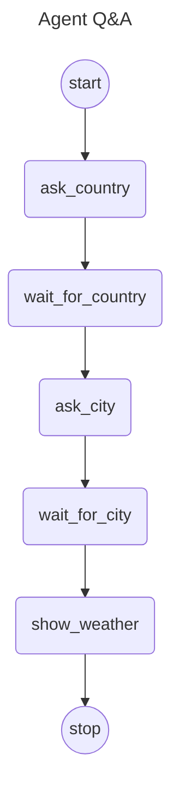

# Langgraph4j Question & Answer Agent

This is a Langgraph4j Human-in-the-Loop (HITL) use case , using interruption and resume through Checkpoints.

‼️Note:
> This is a proof-of-concept to give a guideline on how implement HITL, the LLM reasoning is simulated

The example provides both a CLI based chat and a REST API for help implementing an online chat

## Graph Definition



## Test Scenario
  &nbsp; | &nbsp;
 --- | ---
 User | How is the weather today?
Agent | Which country do you live in?
User |  Germany
Agent | For which city would you like the forecast?
User |  Berlin
Agent | The temperature in Berlin is 35 °C.

## Run example

```
spring-boot:run
```