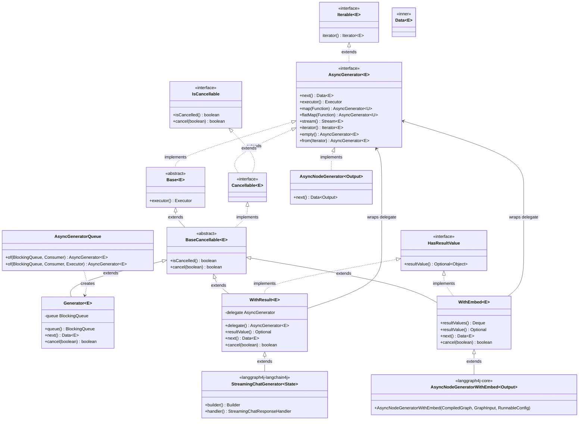

# org.bsc.async.AsyncGenerator 接口及实现类图

基于依赖 **org.bsc.async:async-generator:4.0.0**、**org.bsc.langgraph4j:langgraph4j-core:1.8.1**、**org.bsc.langgraph4j:langgraph4j-langchain4j:1.8.1** 的字节码分析整理。

## 实现类汇总

| 类名 | 所在模块 | 说明 |
|------|----------|------|
| `AsyncGeneratorQueue$Generator<E>` | async-generator | 基于 BlockingQueue 的异步生成器，可取消 |
| `AsyncGenerator$WithResult<E>` | async-generator | 包装委托 AsyncGenerator，带结果值，可取消 |
| `AsyncGenerator$WithEmbed<E>` | async-generator | 包装委托 AsyncGenerator，带嵌入完成回调与结果，可取消 |
| `AsyncGenerator$BaseCancellable<E>` | async-generator | 抽象基类，实现 Cancellable |
| `AsyncGenerator$Base<E>` | async-generator | 抽象基类，实现 AsyncGenerator |
| `CompiledGraph$AsyncNodeGenerator<Output>` | langgraph4j-core | 图流式执行时产生的节点输出流（直接实现 AsyncGenerator） |
| `CompiledGraph$AsyncNodeGeneratorWithEmbed<Output>` | langgraph4j-core | 继承 WithEmbed，图流式执行且带嵌入完成回调的节点输出流 |
| `StreamingChatGenerator<State>` | langgraph4j-langchain4j | 继承 WithResult，LLM 流式对话生成器（产出 StreamingOutput&lt;State&gt;） |

其中 **直接实现 `AsyncGenerator<E>` 的具体类** 有：

- **async-generator**：`AsyncGeneratorQueue$Generator`、`AsyncGenerator$WithResult`、`AsyncGenerator$WithEmbed`（后两者继承 `BaseCancellable`）。
- **langgraph4j-core**：`CompiledGraph$AsyncNodeGenerator`、`CompiledGraph$AsyncNodeGeneratorWithEmbed`（继承 `WithEmbed`）。
- **langgraph4j-langchain4j**：`StreamingChatGenerator`（继承 `WithResult`）。

---

## 类图（Mermaid）

## 简要说明

- **AsyncGenerator&lt;E&gt;**：根接口，继承 `Iterable<E>`，定义 `next()`、`executor()`、`map`/`flatMap`、`stream()`、`iterator()` 等。
- **Cancellable&lt;E&gt;**：子接口，继承 `AsyncGenerator<E>` 与 `IsCancellable`，表示可取消的异步生成器。
- **Base / BaseCancellable**：抽象实现，`BaseCancellable` 在 `Base` 上增加 `cancel(boolean)`、`isCancelled()`。
- **AsyncGeneratorQueue$Generator**：通过 `AsyncGeneratorQueue.of(...)` 创建，内部用 `BlockingQueue<Data<E>>` 缓冲，是典型的“队列式”实现。
- **WithResult / WithEmbed**：对已有 `AsyncGenerator` 的包装，增加结果值（及 WithEmbed 的完成回调），并实现 `Cancellable`。
- **CompiledGraph$AsyncNodeGenerator**：langgraph4j 图编译后 `stream(...)` 返回的生成器之一，直接实现 `AsyncGenerator<NodeOutput<State>>`，用于按节点流式产出输出。
- **CompiledGraph$AsyncNodeGeneratorWithEmbed**：继承 `AsyncGenerator$WithEmbed`，图流式执行且需要嵌入完成回调时使用，产出 `NodeOutput<State>` 并支持 `resultValue()` 等。
- **StreamingChatGenerator&lt;State&gt;**：继承 `AsyncGenerator$WithResult<StreamingOutput<State>>`，用于与 Langchain4j 的流式 Chat 模型对接，通过 `handler()` 作为 `StreamingChatResponseHandler` 传给 `model.chat(request, generator.handler())`，迭代时得到 `StreamingOutput<State>`（如 LLMStreamApp 中的用法）。

若需在文档中区分“仅 AsyncGenerator”与“同时为 Cancellable”的用法，可标注：  
流式图执行若需 `cancel()`，通常会在内部使用或返回 `AsyncGenerator.Cancellable`（例如基于 `AsyncGeneratorQueue$Generator` 或 `WithResult`/`WithEmbed` 的封装）。
