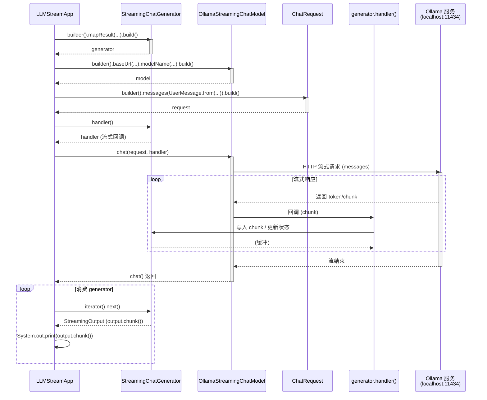

# LLMStreamApp 时序图

## 说明

| 阶段 | 说明 |
|------|------|
| 1. 构建 Generator | `StreamingChatGenerator.builder().mapResult(...).build()` 创建流式结果生成器，`mapResult` 将 LLM 返回的 AI 消息转为 `Map.of("content", text)`。 |
| 2. 构建 Model | `OllamaStreamingChatModel.builder()` 配置 Ollama 地址、模型名、temperature 等。 |
| 3. 构建 Request | `ChatRequest.builder().messages(UserMessage.from(...))` 封装用户问题。 |
| 4. 发起流式对话 | `model.chat(request, generator.handler())` 将 `handler` 作为流式回调传入；Model 向 Ollama 发请求，每收到一段内容就调用 handler，handler 把数据交给 Generator 内部缓冲。 |
| 5. 消费流 | `for (StreamingOutput<AgentState> output : generator)` 遍历 generator（实现 `Iterable`），每次取到 `StreamingOutput`，用 `output.chunk()` 取出当前片段并打印。 |

**注意**：`chat(request, handler)` 一般会阻塞到流式响应结束；之后对 `generator` 的迭代会依次取出已缓冲的 `StreamingOutput`。若库实现为“边收边迭代”，则迭代时可能由 handler 在后台持续写入、当前线程在 next() 上阻塞等待。
