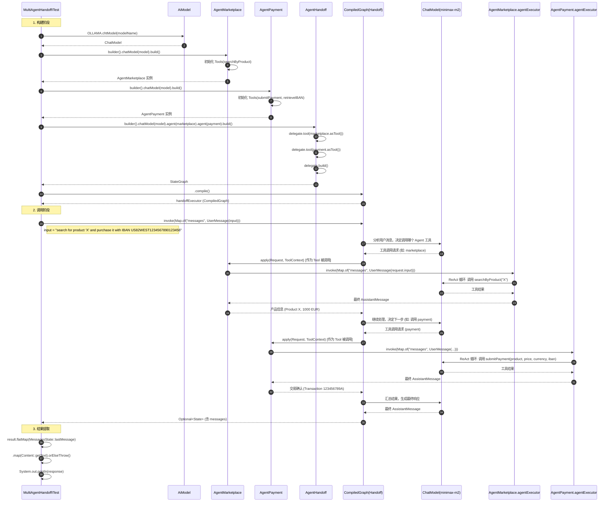
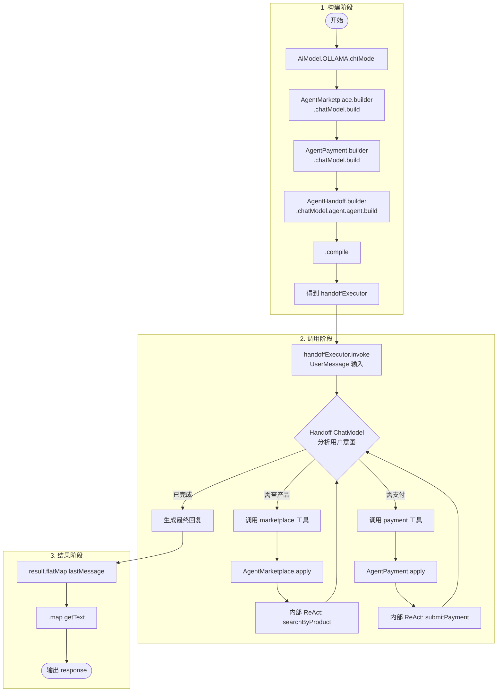
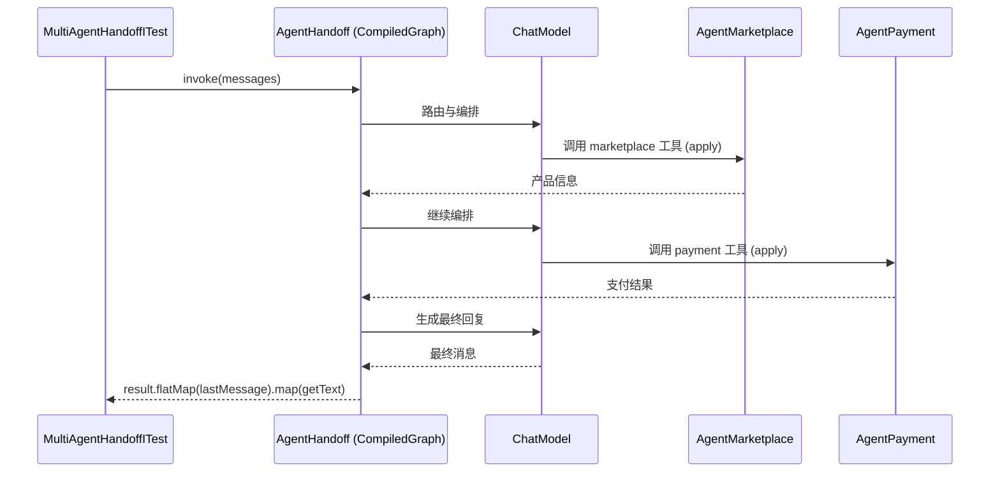

# MultiAgentHandoffITest 调用时序图

## 测试方法: testHandoff()

## 流程图：testHandoff() 执行流程

## 简化版时序图（仅核心调用链）

## 关键类说明

| 参与者 | 说明 |
|--------|------|
| **MultiAgentHandoffITest** | 测试类，构建 AgentMarketplace、AgentPayment、AgentHandoff 并调用 invoke |
| **AgentHandoff** | 协调器，将 Marketplace 与 Payment 注册为工具，内部使用 AgentExecutor/StateGraph |
| **AgentMarketplace** | 市场代理，暴露 `searchByProduct` 工具，作为 Handoff 的一个子工具被调用 |
| **AgentPayment** | 支付代理，暴露 `submitPayment`、`retrieveIBAN` 工具，作为 Handoff 的一个子工具被调用 |
| **AbstractAgentExecutor.apply()** | 当 Handoff 的 LLM 决定调用某 Agent 时，会执行对应 Agent 的 apply，内部再 invoke 该 Agent 的 CompiledGraph |

## 数据流摘要

1. **构建**: Test → AiModel 取 ChatModel → 创建 Marketplace、Payment（各自持有 ChatModel 与 Tools）→ 创建 Handoff 并将两者注册为 tool → compile 得到 handoffExecutor。
2. **执行**: Test 调用 handoffExecutor.invoke(messages) → Handoff 的 ChatModel 解析用户意图 → 按需调用 marketplace 或 payment 的 apply() → 各 Agent 内部执行自己的 ReAct（调用 searchByProduct / submitPayment 等）→ 结果回填到 Handoff → Handoff 的 ChatModel 生成最终回复。
3. **取结果**: Test 从返回的 State 中 lastMessage，再 getText，得到最终响应文本。
